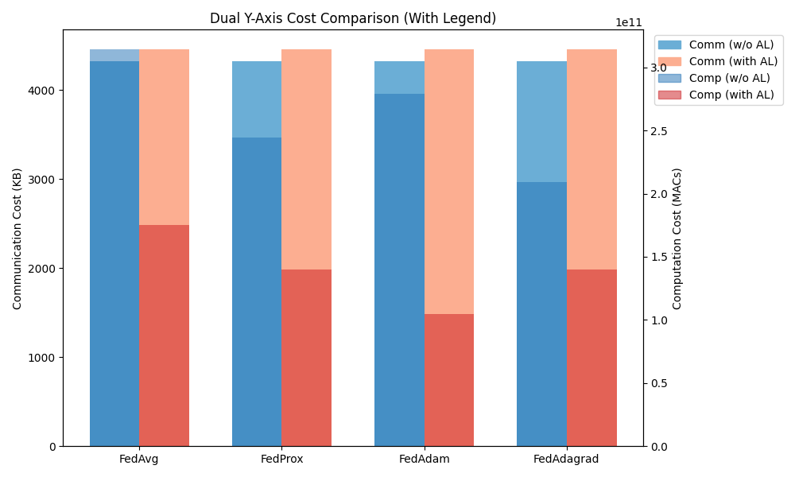
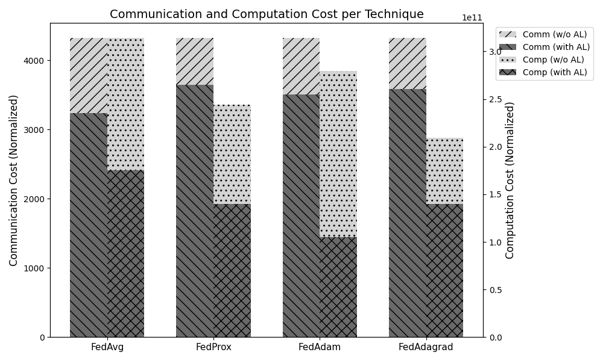

<!-- PROJECT LOGO -->
<p align="center">
  
</p>

<h1 align="center">⚡ FLARE ⚡</h1>
<h3 align="center">
Battery-Free Federated Learning with Adaptive Resource-Aware Sampling
</h3>

<p align="center">
  <i>Robust AI for Intermittent, Energy-Harvesting IoT Devices</i>  
</p>

<p align="center">
  <a href="https://github.com/Solankineeraj03/FLARE/stargazers"></a>
  <a href="https://github.com/Solankineeraj03/FLARE/network/members"></a>
  <a href="https://github.com/Solankineeraj03/FLARE"></a>
  <a href="https://github.com/Solankineeraj03/FLARE/blob/main/LICENSE"></a>
</p>

---

## 🔥 Overview
FLARE (**F**ederated **L**earning with **A**daptive **R**esource-aware **E**xecution) is the **first federated active learning framework** designed for **battery-free, energy-harvesting edge devices**.  

Traditional FL assumes:
- ⚡ Stable power  
- 🏷️ Fully labeled datasets  

…but **intermittent IoT devices** break these assumptions.  
FLARE solves this by combining:  

- ✅ **Task-Aware Active Learning Sampler** → 40% fewer labeled samples  
- ✅ **Reactive Intermittent Computing Model** → Survives frequent power failures  
- ✅ **Communication-Efficient FL Protocols** → 25% lower overhead  
- ✅ **Knowledge Distillation + Adversarial Training** → Robust, label-efficient learning  

---

## 📖 Paper
📄 *"FLARE: Battery-Free Federated Learning Scheme Using Adaptive Resource-Aware Sampling"*  
Accepted to **IEEE Internet of Things Journal (2025)**.  

**Authors:** Sepehr Tabrizchi, Rebati Gaire, **Neeraj Solanki**, Shayan Gerami, Ali Shafiee Sarvestani, Arman Roohi  

---

## ✨ Key Contributions
- 🔋 **Intermittent-Aware FL:** First framework integrating reactive execution with FL  
- 🧠 **Sampler Network:** Learns to pick most-informative samples (task-aware)  
- 🤝 **Federated Coordination:** Aggregates both task model + sampler across clients  
- 🎯 **Label Efficiency:** Achieves target accuracy with **40% fewer labeled samples**  
- 📉 **Lower Cost:** Reduces communication overhead by **25%+**  
- 🛠️ **Hardware-Aware Design:** Works on energy-harvesting IoT platforms  

---

## 📊 Results

| Dataset      | Baseline FL (FedAdam) | **FLARE (FedAdam)** |
|--------------|----------------------|----------------------|
| CIFAR-10     | 64.9% @ 30% labels   | **71.5% @ 30% labels** |
| CIFAR-100    | 35.2% @ 30% labels   | **40.7% @ 30% labels** |
| TinyImageNet | 31.5% @ 30% labels   | **37.2% @ 30% labels** |

<p align="center">
  
</p>

---

## ⚙️ Installation
Clone the repo and install dependencies:
```bash
git clone https://github.com/Solankineeraj03/FLARE.git
cd FLARE
pip install -r requirements.txt
🚀 Usage
Run Federated Learning with FLARE
bash
Copy code
# Example: CIFAR-10 with ResNet18 and FedAdam
python main.py --dataset cifar10 --model resnet18 --strategy FedAdam
Supported Datasets
CIFAR-10

CIFAR-100

TinyImageNet

Supported FL Strategies
FedAvg

FedProx

FedAdam

FedAdagrad

🧩 Repo Structure
bash
Copy code
FLARE/
│── client_indices/     # Pre-generated client data splits (10–100%)
│── fl_client.py        # Client-side training (FeatureExtractor, Classifier, Sampler, Decoder)
│── fl_server.py        # Server aggregation (FedAvg, FedProx, FedAdam, FedAdagrad)
│── models.py           # Network definitions (ResNet/VGG, Decoder, Discriminator, Sampler)
│── utils.py            # Training, logging, evaluation utils
│── macs.py             # Compute cost analysis (MACs, communication)
│── run_experiment.py   # Experimental setup script
│── requirements.txt    # Dependencies
│── README.md           # Project overview (this file)


